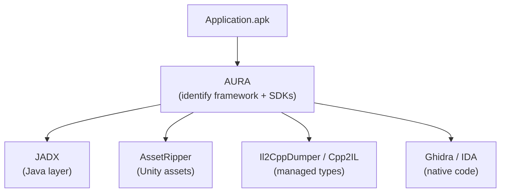

# AURA — Android Unity Runtime Analyzer

Before opening a tool like JADX or apktool, the first question is usually:

> _What am I even looking at?_

AURA can answer that question. It is entirely optional — every step in this handbook works without it. But if you prefer to start with a quick overview before deciding which tools are relevant, AURA gives you that in one command. It inspects an APK, XAPK or APKS package and tells you:

- Which **framework** the application is built with (Unity, Flutter, React Native, Unreal, Godot, Cocos2d-x, ...)
- Which **scripting backend** is used (IL2CPP, Mono)
- Which **third-party SDKs** are present (Firebase, AppsFlyer, Facebook, Google Ads, ...)
- Basic **manifest metadata** (package name, version, SDK levels, permissions, security flags)
- A **recommended workflow** — which tools to use next, based on what was detected

This gives you a clear starting point before diving into any of the tools covered in this handbook.

---

## Installation

```sh
npm install -g android-unity-runtime-analyzer
```

Requires Node.js ≥ 20.

---

## Usage

### inspect

Analyzes an APK, XAPK or APKS package and prints a detection report.

```sh
aura inspect app.apk
aura inspect app.xapk
aura inspect app.apks
```

Add `--verbose` (or `-v`) to also show the full list of activities, services, receivers, providers, permissions and evidence locations:

```sh
aura inspect app.apk --verbose
```

### doctor

Checks whether the tools needed for Android and Unity reverse engineering are installed and reachable on PATH.

```sh
aura doctor
```

Run only specific categories:

```sh
aura doctor --android
aura doctor --frida
aura doctor --native
aura doctor --unity
```

---

## Example output

### inspect

```
AURA APK Inspection
Android package inspector and runtime analysis tooling.

Application
------------
File               com.example.game.apk
Format             APK
Size               142.30 MiB
Package            com.example.game
Version            2.1.0 (210)

Android
------------
Min SDK            24
Target SDK         35
Architectures      arm64-v8a
DEX files          3 (MultiDEX)
Native libraries   8

Frameworks
------------
Unity  CONFIRMED  score 100/100
  Evidence:
    ✓ Unity engine library (+45)
      libunity.so is shipped by Unity Android builds.
    ✓ Unity version 2022.3.18f1 (+5)
      A Unity version string was found in serialized player data.

Backends
------------
IL2CPP  CONFIRMED  score 100/100
  metadataVersion: 29
  Evidence:
    ✓ IL2CPP native library (+55)
      libil2cpp.so contains native code generated from managed assemblies.
    ✓ IL2CPP global metadata (+35)
      global-metadata.dat describes the managed types compiled by IL2CPP.

Recommended workflow
--------------------
 1. JADX
    Inspect the Android layer, entry points, SDK integrations and DEX code.
 2. AssetRipper
    Recover Unity scenes, prefabs, serialized assets and object hierarchies.
 3. Il2CppDumper or Cpp2IL
    Recover managed types, methods, fields and native method addresses.
 4. Ghidra, IDA or Binary Ninja
    Analyze the native implementations inside libil2cpp.so.
```

### doctor

```
AURA Doctor
Environment diagnostics for darwin/arm64.

Core
------------
✓ Node.js                 OK 20.12.1
✓ Java                    OK 21.0.4
✓ Python                  OK 3.12.3
✓ pip                     OK 24.0
- pipx                    MISSING
  → Install pipx with pip install pipx.

Android
------------
✓ ADB                     OK 1.0.41
✓ Android device          OK
  emulator-5554: device (Pixel_8, arm64-v8a, 15)
✓ JADX                    OK 1.5.1
✓ apktool                 OK 2.10.0

Frida
------------
✓ Frida CLI               OK 16.3.3
✓ Frida device connection OK

Native analysis
------------
✓ Ghidra                  OK 11.1.2

Unity tooling
------------
✓ AssetRipper             OK 1.0.0
- Cpp2IL                  MISSING
  → Install Cpp2IL and add its executable to PATH.
- Il2CppDumper            MISSING
  → Install Il2CppDumper and add its executable to PATH.

Summary
------------
8 OK  0 warnings  3 missing  0 errors
```

---

## Where AURA fits in the workflow

AURA is an optional starting point. If you run it, it identifies the framework, backend and SDKs upfront — information that determines which tools are relevant and in which order to use them. If you already know what you're looking for, you can skip it and go straight to any of the chapters below.



Without AURA, you'd open JADX on a Unity IL2CPP game and wonder why there's almost no Java code — because the actual logic is in `libil2cpp.so`. AURA tells you that upfront.

---

[Next: 01 - Android Reverse Engineering](01-android-reverse-engineering.md)
