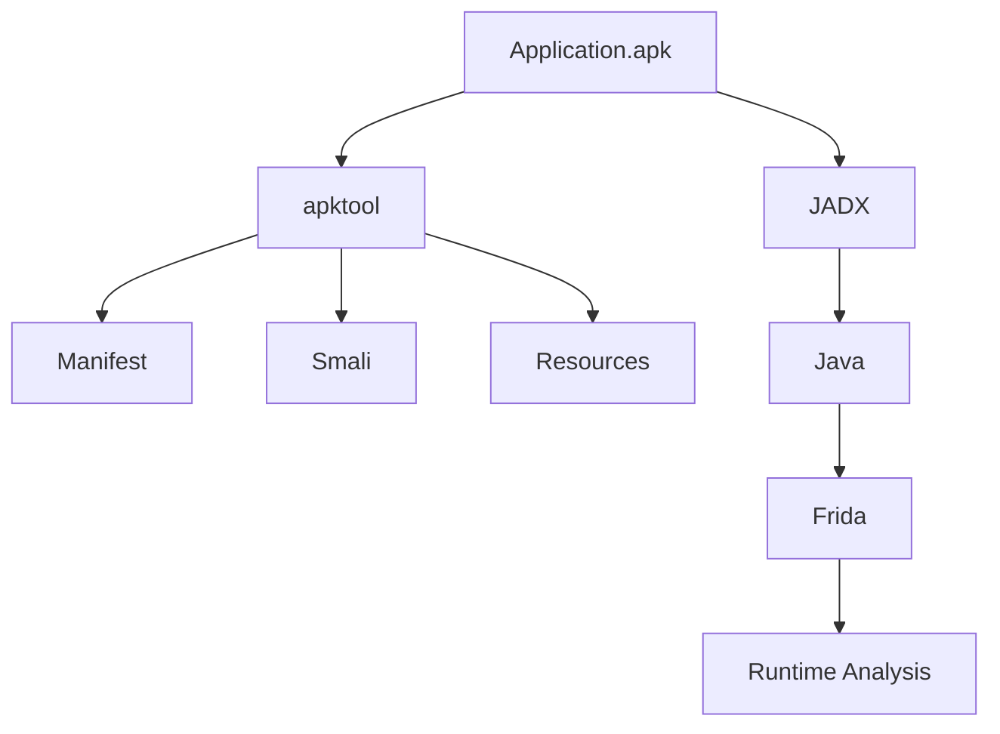

# Android Reverse Engineering

Reverse engineering is the process of understanding how software works without access to its original source code.

For Android applications, this usually means starting from a compiled APK and understanding how the application behaves by combining multiple sources of information: Java code, Smali bytecode, native libraries, application assets and runtime instrumentation.

Unlike source-level development, reverse engineering is rarely a linear process. It is an investigation where each tool reveals a different aspect of the application.

---

# Static and Dynamic Analysis

Android reverse engineering can generally be divided into two complementary approaches.

## Static Analysis

Static analysis consists of inspecting an application **without executing it**.

Typical examples include:

- Reading the Android Manifest
- Inspecting Java or Kotlin code
- Browsing Smali
- Exploring native libraries
- Recovering application assets

Static analysis is usually the fastest way to understand an application's overall architecture.

---

## Dynamic Analysis

Dynamic analysis consists of observing the application **while it is running**.

Instead of asking:

> _"What code exists?"_

dynamic analysis answers questions such as:

- Which methods are currently executing?
- Which objects exist in memory?
- Which network requests are being sent?
- What happens after pressing this button?
- Which native libraries are being loaded?

Runtime instrumentation tools such as **Frida** make this possible.

---

# Reverse Engineering is an Investigation

One of the first things you'll notice is that no single tool answers every question.

A typical investigation naturally moves between several tools depending on what you're trying to understand.

As new questions appear, different tools become useful.

Understanding **which question each tool answers** is often more valuable than mastering every feature of a single one.

---

# Different Questions Require Different Tools

The following table summarises the role of the most common Android reverse engineering tools.

| Tool             | Typical Questions                                   |
| ---------------- | --------------------------------------------------- |
| **AURA**         | What framework, backend and SDKs does this use?     |
| **apktool**      | How is the APK packaged? Can it be rebuilt?         |
| **JADX**         | What does the Java layer do?                        |
| **Smali**        | What does the compiled bytecode actually execute?   |
| **Frida**        | What is happening while the application is running? |
| **Ghidra / IDA** | What does the native code do?                       |

These tools complement each other rather than compete with each other.

---

# The Goal

The purpose of reverse engineering is rarely to understand every line of code.

Instead, the objective is usually to answer a specific question.

For example:

- How is authentication implemented?
- Where does this network request originate?
- Why is this feature disabled?
- Which method is executed after pressing this button?
- Can this behaviour be modified?

Keeping the investigation focused helps determine which tool should be used next.

---

# What's Next?

Now that we've introduced the overall reverse engineering workflow, the next chapter looks at the APK itself.

Understanding how Android applications are packaged provides the foundation for everything that follows.

[02 - APK](02-apk.md)

---
