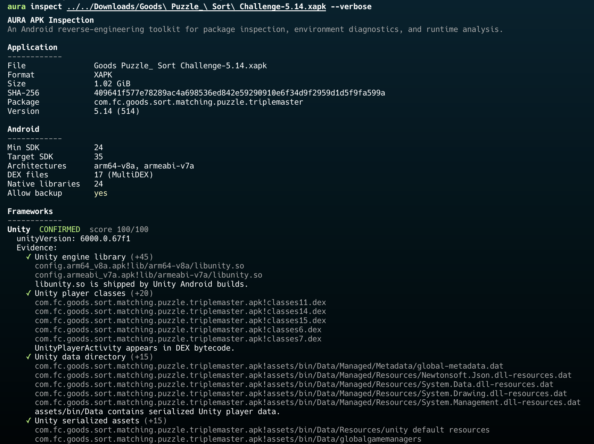
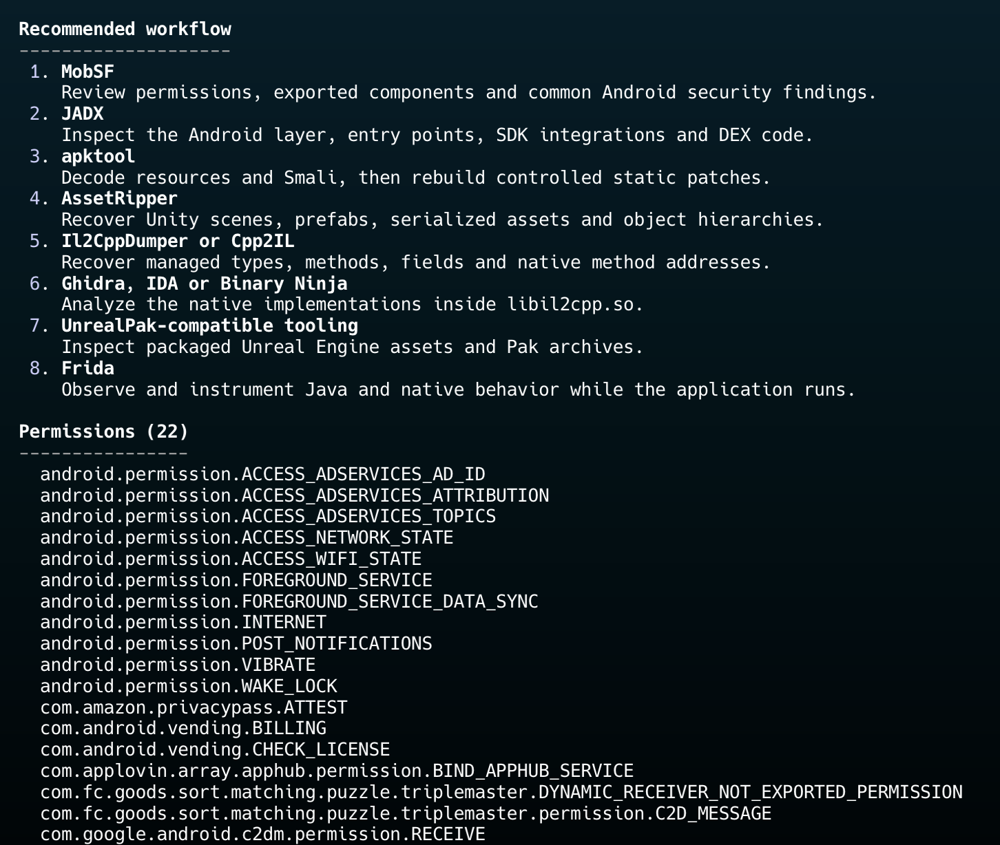

# Walkthrough 01: First Contact

In this walkthrough, we will reverse engineer the Android game **Goods Sorting** from scratch.

We will assume that we know nothing about the application:

- no source code
- no documentation
- no prior knowledge of the game
- no knowledge of the technologies it uses

Our objective is to answer one broad question:

> **How does this application work?**

## Initial reconnaissance

We begin with an XAPK package and no assumptions about how the application was built.

Our first objective is not to modify the application. Before choosing any reverse-engineering tools, we need to identify its structure, the technologies it uses, and the types of code and data contained in the package.

AURA performs this initial reconnaissance:

```bash
aura inspect game.xapk --verbose
```



## Application information

AURA identifies the file as an XAPK and reports the following package information:

```text
File               Goods Puzzle_ Sort Challenge-5.14.xapk
Format             XAPK
Size               1.02 GiB
SHA-256            409641f577e78289ac4a698536ed842e59290910e6f34d9f2959d1d5f9fa599a
Package            com.fc.goods.sort.matching.puzzle.triplemaster
Version            5.14 (514)
```

The SHA-256 hash identifies the exact package analyzed during this walkthrough. It will later allow us to distinguish the original XAPK from rebuilt or modified versions.

An XAPK is a container that can include several APK files. Depending on how the application is distributed, its Android code, native libraries, resources, and Unity assets may be spread across multiple package parts.

AURA analyzes the complete container rather than inspecting only one APK.

## Android structure

AURA reports the following Android characteristics:

```text
Min SDK            24
Target SDK         35
Architectures      arm64-v8a, armeabi-v7a
DEX files          17 (MultiDEX)
Native libraries   24
Allow backup       yes
```

The application contains 17 DEX files.

DEX files contain Android bytecode, generally produced from Java or Kotlin code. The presence of several DEX files means that the application uses MultiDEX, with Android bytecode distributed across multiple files such as `classes.dex`, `classes2.dex`, and so on.

The package also contains 24 native libraries for two processor architectures:

```text
arm64-v8a
armeabi-v7a
```

Native libraries contain compiled machine code. Their presence means that JADX alone will not be sufficient to understand the entire application.

## Technology detection

AURA identifies the frameworks, scripting backends, and third-party SDKs found inside the package.

Each conclusion is accompanied by the artifacts that produced it.

For this application, AURA detected:

```text
Framework: Unity
Backend: IL2CPP
```

The Unity detection is supported by artifacts such as:

```text
libunity.so
UnityPlayerActivity
Unity data files
```

The IL2CPP detection is supported by:

```text
libil2cpp.so
global-metadata.dat
```

These are not guesses based on the appearance or name of the application. They are observable files and components contained in the package.

## Why this matters

The detected technologies determine the rest of the investigation.

A standard Android application would primarily be investigated through Java or Kotlin bytecode using tools such as JADX and apktool.

A Unity IL2CPP application requires several complementary approaches:

```text
JADX
    Android integration, SDKs, activities, services, and Java code

AssetRipper
    Unity scenes, assets, prefabs, and serialized objects

Il2CppDumper
    IL2CPP metadata and native code structure

Ghidra
    Native machine-code analysis

Frida
    Runtime observation and instrumentation
```

AURA uses its findings to generate a recommended workflow for the application.



The recommendation does not mean that every tool must be used immediately. It gives us an ordered starting point based on what AURA found inside the package.

## Initial conclusion

At this point, we have not extracted or modified any application files.

We know how the application was packaged and which major technologies it uses, but we do not yet know where any particular game value or behavior is implemented.

Our next step is to check whether the required tools are installed and correctly configured before beginning the analysis.
