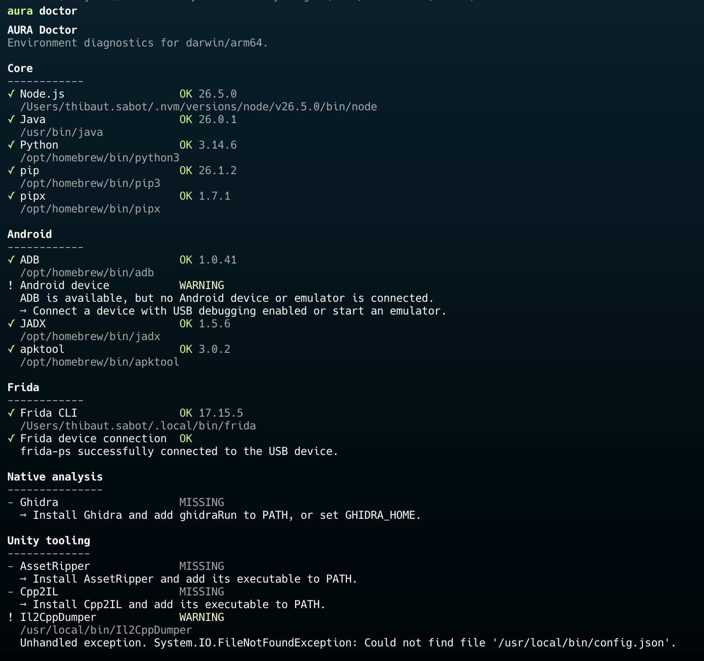

# Walkthrough 02: Preparing the Environment

The initial inspection showed that Goods Sorting is a Unity application using the IL2CPP scripting backend.

AURA also recommended several tools that may become useful during the investigation:

```text
JADX
apktool
AssetRipper
Il2CppDumper
Ghidra
Frida
```

Before using them, we need to verify which tools are installed and whether the Android and Frida environments are working correctly.

AURA provides the `doctor` command for this purpose:

```bash
aura doctor
```



## What AURA checks

The command groups its diagnostics by purpose.

### Android environment

The Android checks include tools and devices used to inspect and interact with Android applications:

```text
ADB
Connected Android devices
JADX
apktool
Java
```

ADB, the Android Debug Bridge, allows a computer to communicate with an Android device or emulator.

We will later use it to perform actions such as:

```text
listing installed packages
installing an APK
launching or stopping the application
reading device information
forwarding ports for Frida
```

JADX and apktool serve different purposes.

JADX attempts to reconstruct readable Java source code from Android DEX bytecode.

apktool decodes Android resources and converts DEX bytecode into Smali assembly. It can also rebuild a modified APK.

### Unity environment

The Unity checks include tools intended for Unity assets and IL2CPP native code:

```text
AssetRipper
Il2CppDumper
Ghidra
```

AssetRipper is primarily used to inspect Unity data such as scenes, prefabs, textures, configuration assets, and serialized objects.

Il2CppDumper and Cpp2IL combine information from:

```text
libil2cpp.so
global-metadata.dat
```

Their purpose is to recover useful information about classes, methods, fields, types, and native addresses from an IL2CPP application.

Ghidra is used to inspect the native machine code contained in libraries such as `libil2cpp.so`.

### Frida environment

The Frida checks verify the local command-line tools and attempt to determine whether a Frida enabled device can be reached.

Frida allows us to observe and instrument a running application.

Later, it may help us answer questions such as:

```text
Which method is called when a button is pressed?
What value does a method return?
Which object contains a particular field?
When is a native function executed?
```

The local Frida client and the Frida server running on the Android device must be compatible. A version mismatch can prevent the computer from connecting to the device.

## Diagnostic results

The environment check can produce the following result:

```text
Java             Available
ADB              Available
Android device   Connected
JADX             Available
apktool          Missing
Frida CLI        Available
Frida device     Unavailable
AssetRipper      Missing
Ghidra           Available
Cpp2IL           Missing
Il2CppDumper     Missing
```

Missing tools are not necessarily immediate blockers.

For the next stage, the most important requirement is JADX because we will begin by examining the Android portion of the application.

## Why begin with the Android layer?

Goods Sorting uses Unity and IL2CPP, but it is still distributed as an Android application.

The package contains Android components responsible for tasks such as:

```text
starting the Unity runtime
handling permissions
integrating advertisements
receiving notifications
connecting third-party SDKs
handling Android lifecycle events
```

JADX will not expose the main IL2CPP gameplay logic, but it can show us how the Android application is structured and how Unity is launched.

This gives us useful context before moving into Unity assets or native code.

## Current conclusion

AURA has now helped us complete two initial tasks:

```text
aura inspect
    Identified the package structure and technologies.

aura doctor
    Checked whether the required analysis environment is available.
```

No application files have been modified.

Our next step is to open the Android package in JADX and determine what can be learned from the Android bytecode.
