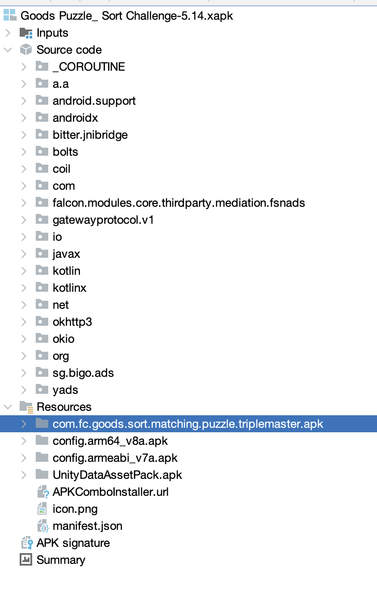
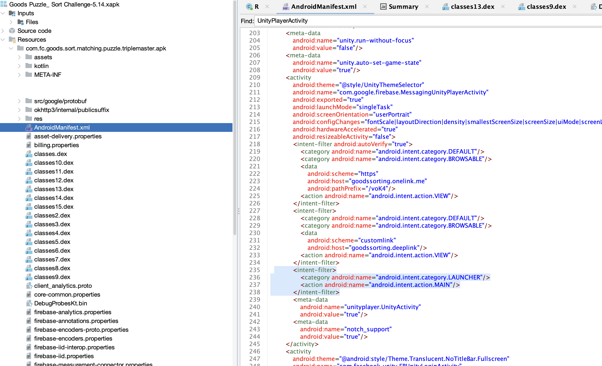
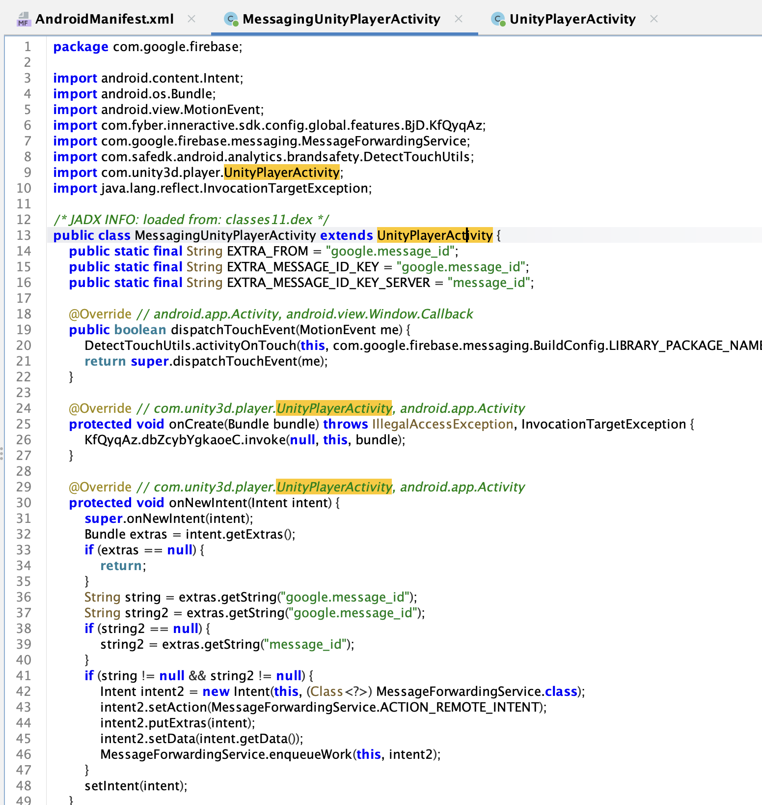
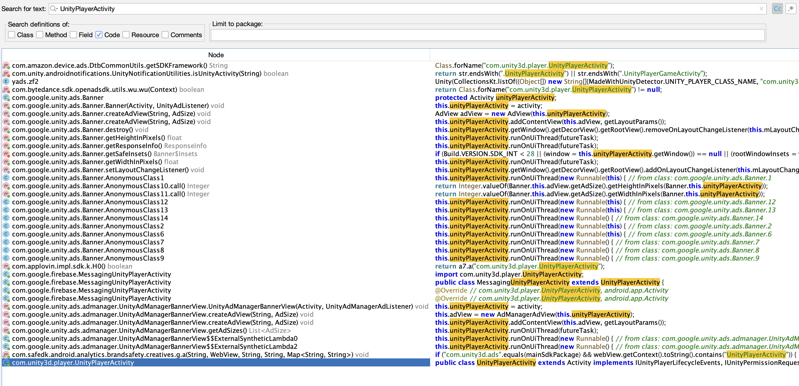
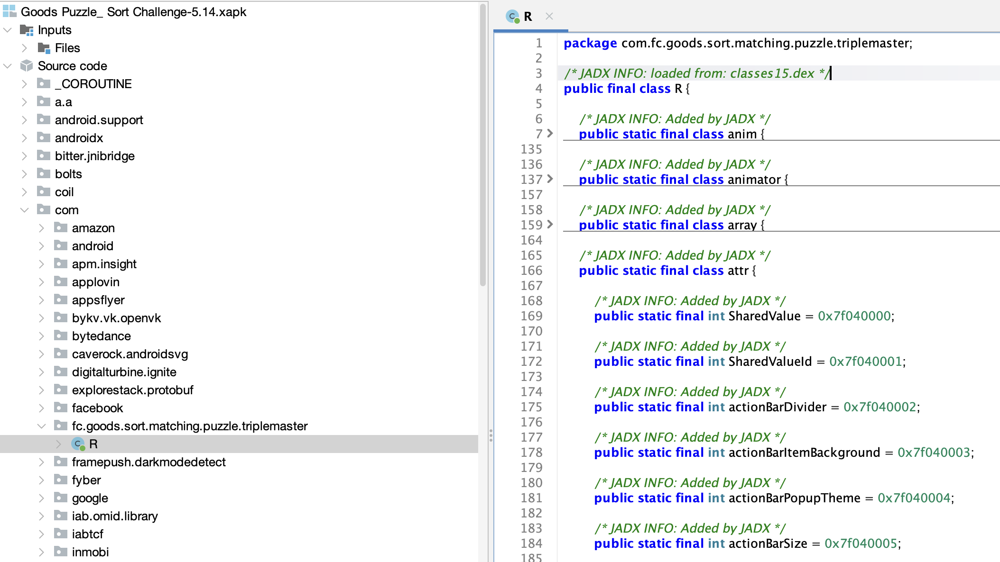

# Walkthrough 03: Opening the Android Layer in JADX

The initial AURA inspection identified Goods Sorting as a Unity application using IL2CPP.

Before examining Unity assets or native code, we begin with the Android portion of the application.

Our objective is limited:

> **What Android code surrounds the Unity application?**

## Opening the XAPK

JADX can open the XAPK container directly:

```bash
jadx-gui game.xapk
```

JADX processes the package parts contained in the XAPK and combines their DEX bytecode and resources into a single project view.



Goods Sorting contains 17 DEX files, so loading and indexing may take some time.

JADX attempts to reconstruct readable Java source code from Android DEX bytecode. The displayed Java is decompiled output, not the original source code, and some methods may be incomplete or inaccurate.

## Inspecting the manifest

We first want to identify:

```text
the launcher activity
the Unity Android integration
the application's own Android package
third-party SDK packages
```

Open:

```text
Resources
└── AndroidManifest.xml
```

The manifest describes Android components such as:

```text
activities
services
receivers
providers
permissions
```

Search for:

```text
MAIN
LAUNCHER
UnityPlayerActivity
```

The activity containing the `MAIN` action and `LAUNCHER` category is the component Android starts when the user opens the application.

For a Unity application, this may be:

```text
com.unity3d.player.UnityPlayerActivity
```

or a custom activity derived from it.



## Finding the Unity integration

Here we can see that the activity name is `com.google.firebase.MessagingUnityPlayerActivity`.

By double clicking on the name, you access the public class ran when the app is opening:



It extends another class, that you can also double click on.

If you prefer, you can also use JADX's global search and look for:

```text
UnityPlayerActivity
```

Also search for:

```text
com.unity3d.player
```

And open the matching activity or Unity integration class.



Look for lifecycle methods such as:

```text
onCreate()
onPause()
onResume()
onDestroy()
```

A typical Unity startup flow looks like this:

```text
Android launches an Activity
        ↓
The Activity initializes UnityPlayer
        ↓
Unity loads its engine and application data
```

In our case, we can see the following code:

```java
public class UnityPlayerActivity extends Activity implements IUnityPlayerLifecycleEvents, IUnityPermissionRequestSupport, IUnityPlayerSupport {
    protected UnityPlayerForActivityOrService mUnityPlayer;

    @Override // com.unity3d.player.IUnityPlayerLifecycleEvents
    public void onUnityPlayerQuitted() {
    }

    protected String updateUnityCommandLineArguments(String str) {
        return str;
    }

    @Override // android.app.Activity
    protected void onCreate(Bundle bundle) {
        requestWindowFeature(1);
        super.onCreate(bundle);
        getIntent().putExtra("unity", updateUnityCommandLineArguments(getIntent().getStringExtra("unity")));
        UnityPlayerForActivityOrService unityPlayerForActivityOrService = new UnityPlayerForActivityOrService(this, this);
        this.mUnityPlayer = unityPlayerForActivityOrService;
        setContentView(unityPlayerForActivityOrService.getFrameLayout());
        this.mUnityPlayer.getFrameLayout().requestFocus();
    }
```

The `onCreate` methods does the following:

- Android creates the Activity
- Unity’s player object is created
- Unity’s frame layout becomes the content of the screen
- Unity receives focus

So this is where the Android app hands control to Unity.

The other methods such as `onResume`, `onPause`, `onDestroy`, etc... mostly forward Android events to Unity.

## Locating the application package

AURA reported the package name:

```text
com.fc.goods.sort.matching.puzzle.triplemaster
```

Locate this namespace in the source tree.

Most of the time, you would see something like:

```text
com.example.game
├── MainActivity
├── UnityBridge
└── BuildConfig
```

(_minimal app packaage_)

or

```text
com.example.game
├── GameActivity
├── NotificationHandler
├── BillingManager
├── DeepLinkActivity
└── BuildConfig

```

(_package with a custom activity_)

In our case, the package is almost empty:



`R` is the generated Android resource class, not real gameplay logic.
For a Unity IL2CPP application, it is normal for the package to contain little gameplay logic.
The main game code was compiled into native code rather than ordinary Java classes.

However, for standard application, most of the code should be there.

## Current conclusion

When we opened the application in JADX, the main package `com.fc.goods.sort.matching.puzzle.triplemaster` contained almost no handwritten Java code.
The only visible class was R, which is a generated resource class.

Most of the remaining packages belonged to third-party SDKs. This suggested that the Android layer was mainly a wrapper around the Unity runtime rather than the location of the game logic.

Our next task is to inspect the launcher activity, identify the Unity startup path, and record what is actually present in the application's Android package.
