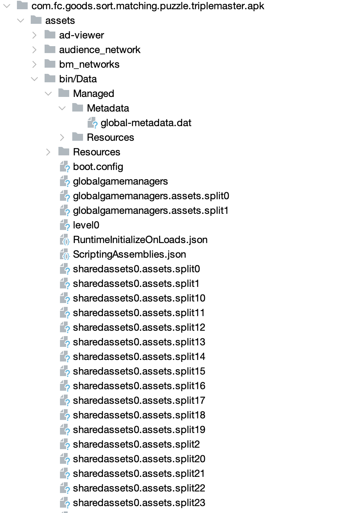
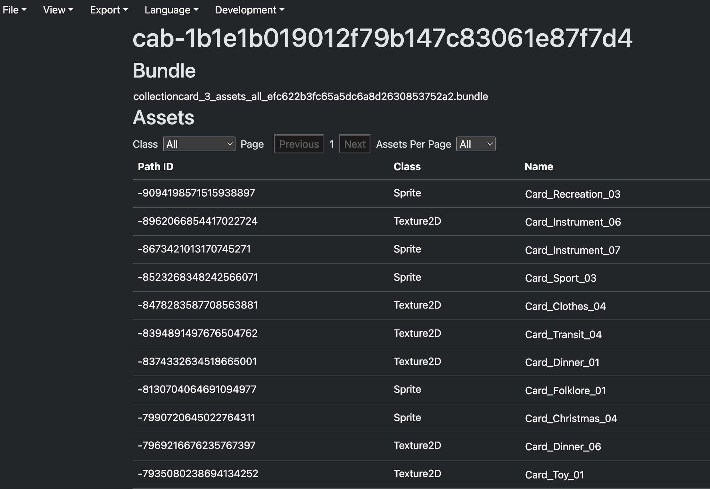
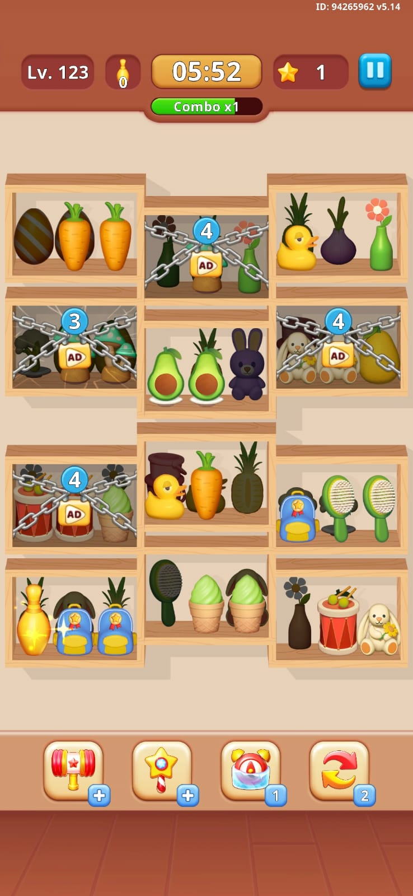
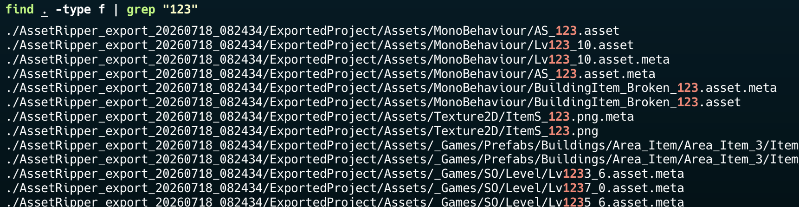

# Walkthrough 04: Opening the Unity Assets

Once I had confirmed that the app was a Unity build running through IL2CPP, I knew I needed to stop looking at the Android wrapper and start poking around the Unity side instead.

That part was not obvious at all at the beginning. The APK still looks like a normal Android app from the outside, and at this stage I did not yet know which files would actually matter. I just knew the useful stuff had to be hidden somewhere in Unity data: levels, items, sprites, prefabs, configs, all the usual suspects.



The package tree gave the first real hints. A few Unity files stood out immediately:

- `global-metadata.dat`
  - IL2CPP metadata. This is one of the big files.
- `globalgamemanagers`
  - Core Unity build data. Usually full of runtime settings.
- `level0`
  - Usually a scene-related asset or scene data.
- `ScriptingAssemblies.json`
  - The list of scripting assemblies used by the build.
- `RuntimeInitializeOnLoads.json`
  - Another Unity-generated file related to startup initialization.
- `sharedassets0.assets.split*`
  - Split Unity asset chunks. These are usually parts of a bigger serialized asset file.

## Opening the package in AssetRipper

That is where AssetRipper comes in. It takes a compiled Unity game and reconstructs the parts that are actually useful for reverse engineering:

- **ScriptableObject data** as readable YAML `.asset` files
- **C# class definitions** as stubs
- **sprites, audio, prefabs** in their exported formats

The important thing is that AssetRipper does not recover method bodies. Those usually come back as empty stubs. But the field declarations are real, and that is exactly the part we need when the goal is to understand how the game is wired.



AssetRipper has a GUI, but I prefer exporting everything into a folder so I can grep through it freely. So I went with **Export** → **Export All Files**.

For this example, I picked level 123 (why not?). I just wanted one concrete target to follow, and level 123 would probably be complex enough to be informative.
Here's an ingame screenshot to show what it looks like:



The exported project folder is huge, so the first thing I did was a quick grep to see what actually existed:



That search surfaced a few files that looked interesting:

- `.../MonoBehaviour/AS_123.asset`
- `.../MonoBehaviour/Lv123_10.asset`
- `.../Texture2D/ItemS_123.png`
- `.../_Games/Sprites/InGame/Item/Items/AS_123.png`
- `.../Sprite/ItemS_123.asset`

## Looking at `Lv123_10.asset`

`Lv123_10.asset` was the first file that looked like it could actually be the level itself, so I opened that next.

```yaml
MonoBehaviour:
  m_Name: Lv123_10
  m_Script: {fileID: 11500000, guid: d99b1bccb7be485d7733c2b02a50f54d, type: 3}
  level:
    timeToPlay: 300
    numberCellLock: 4
    itemHiden: 2
    cells:
    - posX: -9
      posY: 1
      isLock: 0
      itemsLayer:
      - items: 00000000470000004a000000
      - items: 3d0000003e00000000000000
      ...
    mechanics:
    - type: 12
      data: '{"slots":["7:1:1","1:1:1","8:1:1"]}'
    - type: 1
      data: '{"cells":[1,3,6,11]}'
```

And at that point it started to look like a real level file.

There is the timer, the lock count, the hidden-item mechanic count, the cells, and the mechanics section.

The `m_Script` field was the next useful clue, because it tells you which Unity script owns this asset.

A grep on that GUID gave:

```text
ExportedProject/Assets/Scripts/Assembly-CSharp/SOLevel.cs.meta:guid: d99b1bccb7be485d7733c2b02a50f54d
```

While the .meta file isn't providing much, there is a SOLevel.cs alongside it. So I opened `SOLevel.cs` next:

```bash
cat ExportedProject/Assets/Scripts/Assembly-CSharp/SOLevel.cs
```

```csharp
using UnityEngine;

[CreateAssetMenu(fileName = "SOLevel", menuName = "ScriptableObjects/SOLevel", order = 2)]
public class SOLevel : ScriptableObject
{
	public LevelInfo level;

	public bool IsLevelDrop()
	{
		return false;
	}

	public void ValidateLevel()
	{
	}
}
```

That file is still a stub, but the important part is enough: `SOLevel` contains a `LevelInfo`. So even if the logic is gone, the data structure is still there.

## Following `LevelInfo`

The next step was to open `LevelInfo.cs`, because that looked like the actual model behind the YAML.

```csharp
[Serializable]
public class LevelInfo {
    public int timeToPlay;         // seconds (Level 123 = 300)
    public int numberCellLock;     // locked (ad-gated) cells (Level 123 = 4)
    public int itemHiden;          // hidden layer mechanic count (Level 123 = 2)
    public List<CellInfo> cells;   // 12 cells for Level 123, each cell being a block of 3 items
    public List<MechanicData> mechanics;  // extra rules
}
```

I added the comments while reading the file and cross checking it with the level export. The important part here is not the comments, it is the `cells` field.

Then `CellInfo.cs` made the board structure more concrete:

```csharp
[Serializable]
public class CellInfo {
    public int posX;               // board grid X
    public int posY;               // board grid Y
    public int cellType;           // visual variant
    public int numberLayer;        // number of used layers
    public int moveType;
    public float speed;
    public int isLock;             // 1 = locked behind ad, 0 = free
    public List<ItemsInLayerCell> itemsLayer;  // 8 layers per cell
}
```

And `ItemsInLayerCell` was tiny, but it mattered a lot:

```csharp
[Serializable]
public class ItemsInLayerCell {
    public List<int> items;
}
```

So far so good! The board is really a list of `CellInfo`, each cell has coordinates and layers, and each layer contains a list of item IDs.

## Crossing over into the item classes

Once the level structure was clear enough, I wanted to know what those item IDs actually mapped to. That led to `Item.cs` in the same folder. I figured that `Item.cs` would be a good condidate to explain `List<int> items`.

`Item.cs` starts very simply:

```csharp
public class Item : ItemBase
```

That does not look like much, but it tells you that `Item` herits from an `ItemBase` class.

`ItemBase.cs` gives the more important hint:

```csharp
public abstract class ItemBase : MonoBehaviour

[...]

[SerializeField]
protected ItemType _itemType;
```

That field is the bridge between the serialized level data and the actual in-game object.

Then `ItemType.cs` gives the item catalog:

```csharp
public enum ItemType
{
	None = 0,
	AS_1 = 1,
	AS_2 = 2,
	AS_3 = 3,
	AS_4 = 4,
	AS_5 = 5,
	AS_6 = 6,
	AS_7 = 7,
  ...
}
```

At first glance this is just a huge enum. But once you connect it to the first `123` grep, you notice the `AS_123.asset` file.
The naming starts to line up nicely.

## Looking at `AS_123.asset`

The next file I opened was the item definition for `AS_123`.

```yaml
[...]
m_EditorHideFlags: 0
m_Script: { fileID: 11500000, guid: 051e3ef79c89d325ba36777885beab6e, type: 3 }
m_Name: AS_123
m_EditorClassIdentifier:
type: 123
sprite:
  m_AssetGUID: 1bf89bf6b1194d2429e8e9d2f16f8c2a
  m_SubObjectName:
  m_SubObjectType:
spriteHidden:
  m_AssetGUID: 50bf32f133a9f364787b082c73b6fd9a
  m_SubObjectName:
  m_SubObjectType:
kind: 0
colors: 17
```

So `AS_123` is not the sprite itself. It is the item definition that tells the game which sprite to use for the visible version and which sprite to use for the hidden version.

That mattered, because it meant the art on the board was coming from a mapping layer, not directly from the level file.

The visible sprite GUID is `1bf89bf6b1194d2429e8e9d2f16f8c2a`. We know what do to! Grep the asset GUID:

```bash
grep -r 1bf89bf6b1194d2429e8e9d2f16f8c2a AssetRipper_export/
AssetRipper_export/ExportedProject/Assets/MonoBehaviour/AS_123.asset:    m_AssetGUID: 1bf89bf6b1194d2429e8e9d2f16f8c2a
AssetRipper_export/ExportedProject/Assets/_Games/Sprites/InGame/Item/Items/AS_123.asset:    1bf89bf6b1194d2429e8e9d2f16f8c2a: 21300000
```

The first file is the one we are corrently in, the second is the one that actually matters here, because it is the sprite asset behind the item.

```yaml
Sprite:
  m_ObjectHideFlags: 0
  m_CorrespondingSourceObject: {fileID: 0}
  m_PrefabInstance: {fileID: 0}
  m_PrefabAsset: {fileID: 0}
  m_Name: AS_123
  [...]
  m_RenderDataKey:
    1bf89bf6b1194d2429e8e9d2f16f8c2a: 21300000
  m_AtlasTags: []
  m_SpriteAtlas: {fileID: 0}
  m_RD:
    serializedVersion: 3
    texture: {fileID: 2800000, guid: 078deefa3a2e063449c877da9a1a4088, type: 3}
    alphaTexture: {fileID: 0}
    secondaryTextures: []
    m_SubMeshes:
    - serializedVersion: 2
```

Oh, a texture GUID! Let's grep that as well:

```zsh
grep -r 078deefa3a2e063449c877da9a1a4088 AssetRipper_export/
AssetRipper_export/ExportedProject/Assets/_Games/Sprites/InGame/Item/Items/AS_123.asset:   texture: {fileID: 2800000, guid: 078deefa3a2e063449c877da9a1a4088, type: 3}
AssetRipper_export/ExportedProject/Assets/_Games/Sprites/InGame/Item/Items/AS_123.png.meta:guid: 078deefa3a2e063449c877da9a1a4088
```

Finally, a PNG file !!
I couldn't help myself but to open `Assets/_Games/Sprites/InGame/Item/Items/AS_123.png`:


Look at how cute it is!

## The part where I had to cheat a little

If we go back to our original file `Lv123_10.asset`, we now understand that we have 300s to play it, 4 cells are being blocked by an ad.
Thanks to the mScript attached, we also understand that the cell object in the YAML snows the position of each block of 3 items. There are 12 blocks in this file which is what the screenshot looks like.
Each of the blocks as an item layer:

```yaml
      itemsLayer:
     - items: 4a0000004a000000da000000
     - items: 4d0000003f00000000000000
     - items: 500000000000000050000000
     - items: 5c000000000000005c000000
     - items: 620000001b01000000000000
     - items: 6d0000000000000068000000
     - items: 77000000000000006c000000
     - items: 000000007e00000081000000
```

and we know how to get the PNG of an item.
However `4a0000004a000000da000000` doesn't really look like `AS_N.png` to me...

For this one, I have to admit I was out of idea and asked ChatGPT for help. Turns out, it was not that difficult.

```
Items are serialized as a hex blob in the YAML. Each blob encodes 3 × 4-byte little-endian int32 values:

"00000000470000004a000000" → bytes → [0x00000000, 0x00000047, 0x0000004a] → [0, 71, 74]
slot 0=empty slot 1=AS_71 slot 2=AS_74

```

So a block like that is really saying something like:

- slot 0 = empty
- slot 1 = `AS_71`
- slot 2 = `AS_74`

## Recap

We went through a lot of files, but the story is actually pretty simple once you see it in order:

1. the app is a Unity build running through IL2CPP,
2. AssetRipper turns the binary Unity content into readable files,
3. `Lv123_10.asset` gives us the level template,
4. `LevelInfo`, `CellInfo`, and `ItemsInLayerCell` explain how the board is stored,
5. `ItemType`, `AS_123.asset`, and the sprite assets explain how the item catalog maps to actual images,

That is the point where the game stops feeling like a black box and starts looking like a set of linked data files.

## File hierarchy

```
AssetRipper_export/
├── Assemblies/                        ← .NET DLLs (IL2CPP stubs, not real code)
├── Assets/                            ← Raw game assets (sprites, audio)
│   └── _Games/
│       └── Sprites/
│           └── InGame/
│               └── Item/
│                   └── Items/
│                       ├── AS_1.png    ← Item sprite for ItemType 1
│                       └── AS_1.asset   ← Sprite metadata
└── ExportedProject/
   └── Assets/
       ├── MonoBehaviour/              ← ScriptableObject data (YAML)
       │   ├── Lv1_10.asset            ← Level 1 layout data
       │   ├── Lv123_10.asset          ← Level 123 layout data  ← KEY FILE
       │   ├── AS_1.asset              ← Item definition for type 1
       │   ├── AS_71.asset             ← Item definition for type 71
       │   └── SOCell.asset            ← Cell visual configuration
       └── Scripts/
           └── Assembly-CSharp/        ← C# source stubs (bodies are EMPTY)
               ├── LevelInfo.cs
               ├── CellInfo.cs
               ├── ItemsInLayerCell.cs
               ├── ItemType.cs
               └── SOLevel.cs
```

The tree is useful because it shows the three layers we keep crossing between:

1. the level data,
2. the item catalog,
3. the sprite assets.

The screenshot only becomes readable when those three layers are combined.

> **Note:** the subfolder names under `Assets/` vary by game. `_Games/` is specific to this title. The `MonoBehaviour/` and `Scripts/Assembly-CSharp/` folders are the important part.

## The remaining mechanic data

The last piece in `Lv123_10.asset` is the `mechanics` section that we are still yet to understand:

```yaml
mechanics:
  - type: 12
    data: '{"slots":["7:1:1","1:1:1","8:1:1", ... ,"11:7:2"]}'
```
